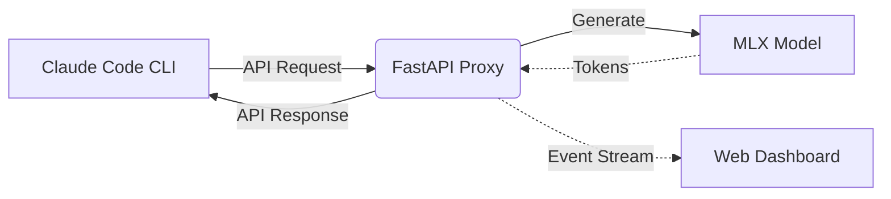

# Claude Code MLX Proxy - Brainstorming Ideas

## Big Picture: What is this document?
> **Junior tip:** This document outlines potential new features to improve our local Claude Code proxy. We look at missing API features, performance boosts, and developer experience (DX) improvements.

This document explores three major areas for improvement:
1. **Prompt Caching** (Performance)
2. **Observability Dashboard** (Developer Experience)
3. **Dynamic Model Routing** (Architecture & Cost/Speed)

---

## Idea 1: Prompt Caching (Context Re-use)

### The Approach
Claude API supports "Prompt Caching" to avoid re-calculating tokens for huge unchanged contexts (like system prompts or large file reads). We can keep the "Key-Value (KV) Cache" in memory across requests if the start of the prompt is identical.

### The Why (Tradeoffs)
- **Why this?** Claude Code sends the *entire* conversation history and file contents on every turn. Recalculating 10k tokens takes seconds. Caching reduces time-to-first-token (TTFT) from seconds to milliseconds.
- **Tradeoff:** It consumes more RAM to keep the KV cache alive between API calls instead of wiping it immediately.

### The Pattern
- **Pattern Name:** Flyweight / Caching Pattern
- **One-Line ELI5:** Remembering the hard work you already did so you don't have to do it again.
- **Why Here:** The prefix of the prompt (system instructions, file context) rarely changes between back-and-forth turns, making it highly reusable.
- **Real Analogy:** Reading a textbook and keeping your bookmark on page 100, instead of re-reading from page 1 every time you open the book.

---

## Idea 2: Observability Dashboard (Web UI)

### The Approach
A small React/HTML frontend served by our FastAPI server that shows, in real-time, what Claude Code is asking and what the local model is thinking.

### The Why (Tradeoffs)
- **Why this?** Terminal logs are messy. When Claude Code gets stuck in an infinite loop, it's hard to see *why*. A dashboard lets developers inspect the raw JSON, tool calls, and `<think>` blocks cleanly.
- **Tradeoff:** Adds complexity to a currently simple, single-file proxy server. We might need to handle static file serving.

### The Pattern
- **Pattern Name:** Observer Pattern (via Server-Sent Events or WebSockets)
- **One-Line ELI5:** A loud speaker broadcasting updates to anyone who is listening.
- **Why Here:** The dashboard needs to update live as the proxy processes requests, without the dashboard constantly asking "are you done yet?".
- **Real Analogy:** A sports commentator giving live play-by-play updates on the radio.

### Architecture Flow

---

## Idea 3: Dynamic Model Routing

### The Approach
Instead of hardcoding one `MODEL_NAME` in `.env`, we configure a small model (e.g., Qwen 1.5B) for simple tasks and a large model (e.g., Qwen 32B) for complex tasks, deciding which to use based on the input.

### The Why (Tradeoffs)
- **Why this?** Simple commands like checking the OS or reading a small file don't need a massive, slow 32B model. We can save battery and time on MacBooks by routing simple requests to a faster model.
- **Tradeoff:** The proxy must load multiple models into memory simultaneously (heavy on VRAM) or swap them out dynamically (slow).

### The Pattern
- **Pattern Name:** Strategy Pattern (or Router)
- **One-Line ELI5:** Having different experts for different problems, and a receptionist who decides which expert you should see.
- **Why Here:** We have multiple "algorithms" (models) to generate text, and we want to pick the optimal one at runtime based on the problem's complexity.
- **Real Analogy:** Going to a hospital. A nurse treats a papercut (small model), but a surgeon does heart surgery (large model).

---

## Idea 4: Local Embedding Server (RAG Support)

### The Approach
Exposing an endpoint (`/v1/embeddings`) that uses a tiny, fast MLX model (like `nomic-embed-text`) to generate vector embeddings mathematically representing the meaning of code blocks.

### The Why (Tradeoffs)
- **Why this?** If Claude Code eventually needs to search massive codebases, reading the whole thing is slow. RAG (Retrieval-Augmented Generation) lets it search embeddings first.
- **Tradeoff:** Adds a second model dependency. The proxy will need a dedicated route and background worker to handle high-throughput embedding requests efficiently.

### The Pattern
- **Pattern Name:** Facade Pattern
- **One-Line ELI5:** Hiding a messy, complicated machine behind a simple, easy-to-use control panel.
- **Why Here:** We hide the complex MLX tensor math and just give Claude Code a standard OpenAI-style embedding endpoint to talk to.
- **Real Analogy:** Starting a car. You turn the key (the Facade); you don't need to manually inject fuel or spark the engine yourself.

---

## Idea 5: Tool Execution Mocking (Testing)

### The Approach
Adding a configuration flag (`--dry-run` or similar) where the proxy intercepts hazardous tool calls (like `bash_command` containing `rm -rf`) requested by the model and automatically returns a fake positive result, skipping actual execution.

### The Why (Tradeoffs)
- **Why this?** When testing new OS-level agents, letting them run raw bash commands is dangerous. A mock layer lets developers safely test how the model sequence behaves without risking side effects.
- **Tradeoff:** We have to maintain a dictionary of realistic "fake responses" for tools. It might cause the model to act differently if the mock response isn't accurate enough.

### The Pattern
- **Pattern Name:** Proxy / Mock Pattern
- **One-Line ELI5:** A stunt double standing in for the real actor during dangerous scenes.
- **Why Here:** We need to intercept requests meant for the real system (the OS) and substitute a harmless fake version.
- **Real Analogy:** The "demo mode" on a store's display phone. It looks like it dials a number, but it doesn't actually place the call.

---

## Idea 6: Graceful Model Unloading (VRAM Management)

### The Approach
Implementing a timeout mechanism where the proxy automatically unloads the heavy MLX model from Mac's unified memory (VRAM/RAM) if no requests have been received for X minutes, reloading it automatically when a new request arrives.

### The Why (Tradeoffs)
- **Why this?** A 4B or 8B model hogs 4-8GB of memory just sitting idle. When a developer switches tasks to compile code or run Photoshop, that memory is wasted.
- **Tradeoff:** The first request after a timeout takes a 5-10 second hit to reload the model from disk (Time-to-First-Token spikes completely).

### The Pattern
- **Pattern Name:** Lazy Loading / Singleton (with TTL cache expiration)
- **One-Line ELI5:** Not packing your gym bag until you're absolutely sure you're going to the gym.
- **Why Here:** The model weights are a massive resource. We only want them occupying the scarce resource (memory) when actively needed.
- **Real Analogy:** Motion-sensor lights in an office building. They turn off when no one is in the room to save electricity.

---

## Idea 7: Persistent Structured Logging & Error Tracing

### The Approach
Moving away from simple `print()` statements in `main.py` to using a structured logger (like Python's `logging` or `loguru`). We would create a rotating `.logs/` folder that outputs neatly formatted JSON lines, separated by request ID.

### The Why (Tradeoffs)
- **Why this?** Terminal logs scroll by so fast during streaming that they are impossible to read later. When a tool call crashes Claude Code, you want to open a persistent file and trace exactly which tokens the local MLX model produced.
- **Tradeoff:** Writing massive payloads to disk slows down the main thread if not done asynchronously.

### The Pattern
- **Pattern Name:** Event Sourcing / Structured Logging
- **One-Line ELI5:** Writing an airplane's black-box flight recorder.
- **Why Here:** We need an immutable chronological record of exactly what data arrived and what generated text went out, to reproduce bugs later.
- **Real Analogy:** A bank ledger. Instead of just knowing your balance today, you have a line for every single time money moved in or out.

---

## Idea 8: Asynchronous Pre-filling (Speed Boost)

### The Approach
Instead of hitting the `uvicorn` endpoint and *then* blocking the API response while MLX slowly crunches through 8,000 tokens of file context (which currently takes several seconds before the first word is typed), we can trigger the prompt ingestion on a background thread the moment the JSON request begins to arrive.

### The Why (Tradeoffs)
- **Why this?** "Time to First Token" (TTFT) is the most critical metric for user experience. Pre-filling the context window asynchronously while the request is still parsing would make the terminal feel snappy and instant, rather than sluggish.
- **Tradeoff:** Python's Global Interpreter Lock (GIL) makes true parallelism tricky. Fast context loading in Apple MLX might require careful threading using `asyncio` or MLX-specific stream yielding optimizations.

### The Pattern
- **Pattern Name:** Promise / Future Pattern (Asynchronous Execution)
- **One-Line ELI5:** Ordering your food ahead on an app so it's ready when you walk in the door.
- **Why Here:** We have an I/O bound wait (receiving the API request) and a CPU/GPU bound wait (tokenizing the prompt). We should overlap them instead of doing them one after another.
- **Real Analogy:** Preheating the oven while you are still mixing the cake batter.

---

## Idea 9: Auto-Summarization of Stale Context

### The Approach
Before passing everything to the MLX model, the proxy checks the token count. If it approaches the model's absolute limit (e.g. 8000 tokens), the proxy intercepts the oldest conversation `messages` array, extracts them, and runs a very fast summarization pass using a tiny model (or a specific prompt) to compress the history into a single paragraph, replacing the old messages.

### The Why (Tradeoffs)
- **Why this?** Local models crash with "Out of Memory" (OOM) errors if the context window is exceeded. Claude Code blindly sends the entire history until the server rejects it. Summarizing stale context prevents the proxy from crashing without losing the "gist" of the conversation.
- **Tradeoff:** The model loses exact line-by-line recollection of things said 10 turns ago. It also adds a slight delay if the summarization pass needs to run mid-request.

### The Pattern
- **Pattern Name:** Middleware / Interceptor Pattern
- **One-Line ELI5:** A bouncer at a club who tells the old guests they have to leave so new guests can come in.
- **Why Here:** We need to modify the data payload coming from the client *before* it reaches the core logic (the MLX generate function) based on an internal rule (token limits).
- **Real Analogy:** Taking handwritten notes during a 2-hour lecture so you only have to review 1 page of bullet points later instead of re-watching the entire video.

---

## Idea 10: Human-in-the-Loop (HITL) Terminal Prompts

### The Approach
When the MLX model decides to use a high-risk tool (like `bash_command` or `replace_file_content`), the proxy pauses the API response and prints a prompt directly in the *proxy server's* terminal: `Model wants to run: rm -rf node_modules. Allow? [y/N]`. If approved, it forwards the tool call back to Claude Code. If denied, it tells Claude Code "Tool execution was rejected by user."

### The Why (Tradeoffs)
- **Why this?** Running local open-source models as fully autonomous agents is dangerous. They hallucinate often and might execute destructive commands. Claude Code has its own safety checks, but having a hard-kill switch at the proxy layer guarantees safety when testing experimental models.
- **Tradeoff:** The developer has to watch two terminals at once (the Claude Code terminal and the local proxy server terminal) to approve commands, which slows down the workflow.

### The Pattern
- **Pattern Name:** Chain of Responsibility
- **One-Line ELI5:** A permission slip that has to be signed by your teacher, then your principal, then your parents before you can go on the field trip.
- **Why Here:** The tool call request has to pass through a specific explicit validation node (the human) before it is allowed to continue down the chain to the client.
- **Real Analogy:** A bank calling your cell phone to ask "Did you just try to buy a $3,000 TV in another country?" before they allow the credit card charge to go through.
