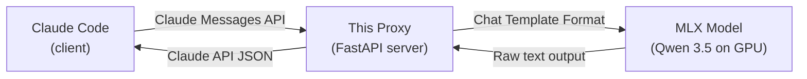

# Qwen 3.5 Compatibility Plan for claude-code-mlx-proxy

## 🛠️ Execution Status: Draft

### 🔍 Points of Uncertainty

| # | Question | Impact |
|---|----------|--------|
| 1 | Which Qwen 3.5 MLX model size will you run? (0.8B / 2B / 4B / 9B / 27B / 35B-A3B) | Determines VRAM requirements |
| 2 | Do you want **vision/image** support? Qwen 3.5 is a vision-language model | Requires `mlx-vlm` instead of `mlx-lm` — a different dependency |
| 3 | Do you need to support both GLM-4.5-Air AND Qwen 3.5 at the same time, or just swap via `.env`? | Multi-model architecture vs. simple config change |
| 4 | This project depends on `mlx-lm` (macOS Apple Silicon only). Are you running a Mac for testing? | Affects how we verify |

### ⚠️ Potential Effects of Uncertainty

- If vision → must add `mlx-vlm` dependency and image handling (significant extra work)
- If multi-model → need model-specific adapters; if swap only → simpler single-adapter approach
- If no Mac → can only plan + write code, cannot test

---

## Big Picture: What Does This Project Do?

> **Junior tip:** This project is a **translation proxy**. Think of it like a bilingual waiter: Claude Code (the customer) speaks "Claude API language", but the kitchen (your local GPU running MLX) speaks "chat template language". The proxy translates orders back and forth.



**Currently working:**
- ✅ Text messages (user ↔ assistant)
- ✅ System prompts
- ✅ Streaming (SSE) and non-streaming responses
- ✅ Token counting
- ✅ Chat template application via `tokenizer.apply_chat_template()`

**Gaps for Qwen 3.5 + Claude Code:**
- ❌ **Tool calling** — Claude sends JSON `tool_use`/`tool_result` blocks; Qwen 3.5 uses XML
- ❌ **Thinking blocks** — Qwen outputs `<think>...</think>`; Claude API has `thinking` content blocks
- ❌ **Tool content in messages** — `tool_use`/`tool_result` blocks are silently dropped to text
- ❌ **Generation params** — Qwen benefits from `repetition_penalty` and tuned defaults

---

## Design Pattern: Adapter Pattern

- **One-Line ELI5:** Converts one interface into another so two incompatible systems can work together.
- **Why Here:** Claude Code speaks "Claude API format" for tool calls (JSON), but Qwen 3.5 expects its chat template format and outputs XML tool calls. The adapter translates.
- **Real Analogy:** A power plug adapter that lets a US plug work in a European outlet.

---

## Proposed Changes (5 Phases)

### Phase 1: Tool Calling Translation (Claude JSON ↔ Qwen XML)

> **What:** Translate Claude API tool definitions into the format Qwen's chat template expects, and parse Qwen's XML tool-call output back to Claude format.

#### Claude tool call format (what Claude Code sends/expects)

```json
// Request:
{"tools": [{"name": "read_file", "input_schema": {"type": "object", "properties": {"path": {"type": "string"}}}}]}

// Response with tool_use:
{"content": [{"type": "tool_use", "id": "toolu_123", "name": "read_file", "input": {"path": "foo.py"}}],
 "stop_reason": "tool_use"}

// Follow-up with tool_result:
{"role": "user", "content": [{"type": "tool_result", "tool_use_id": "toolu_123", "content": "...file contents..."}]}
```

#### Qwen 3.5 tool call format (what the model outputs)

```xml
<function=read_file><parameter=path>foo.py</parameter></function>
```

#### New functions in `main.py`

1. **`format_tools_for_chat_template(tools)`** — Convert Claude `tools` list → OpenAI-style function defs for `apply_chat_template(tools=...)`
2. **`parse_tool_calls_from_response(text)`** — Parse `<function=...>` XML → Claude `tool_use` blocks
3. Modify `format_messages_for_model()` to pass tools to the chat template
4. Modify response builders to set `stop_reason: "tool_use"` when tool calls are detected

---

### Phase 2: Thinking/Reasoning Block Handling

> **What:** Extract `<think>...</think>` blocks from Qwen output and optionally map them to Claude's `thinking` content block type.

New function: `parse_thinking_blocks(text)` → returns `(clean_text, thinking_text_or_None)`

When the request has `thinking.type == "enabled"`, include thinking content before text in the response.

---

### Phase 3: Tool Content Extraction Enhancement

> **What:** Currently `extract_text_from_content()` only handles `text` blocks. We need to also convert `tool_use` and `tool_result` blocks into text for the model prompt.

Enhance `extract_text_from_content()`:
- `tool_use` → `"[Calling tool: {name}({json_input})]"`
- `tool_result` → `"[Tool result for {tool_use_id}: {content}]"`

---

### Phase 4: Generation Parameter Tuning

> **What:** Add `REPETITION_PENALTY` config option. Qwen 3.5 benefits from `repetition_penalty=1.1`.

- Add to `config.py`: `REPETITION_PENALTY`
- Pass to `generate()` / `stream_generate()` if supported by mlx-lm version

---

### Phase 5: Config & Documentation Updates

- Add Qwen 3.5 example config to `.env.example`
- Update `README.md` with Qwen 3.5 setup instructions
- Document recommended model choices (4B for lighter, 9B/27B for better quality)

---

## Verification Plan

### Automated Tests
- No existing tests in the project. We will add unit tests for the new translation functions:
  - `test_format_tools_for_chat_template()`
  - `test_parse_tool_calls_from_response()`
  - `test_parse_thinking_blocks()`
  - `test_extract_text_from_content_with_tool_blocks()`
- Tests will be in `tests/test_translation.py`
- Run with: `uv run python -m pytest tests/`

### Manual Verification
> **Note:** This requires a Mac with Apple Silicon to actually run the MLX model. Steps for manual testing:

1. Set `.env` to use a Qwen 3.5 model (e.g., `MODEL_NAME=mlx-community/Qwen3.5-4B-MLX-4bit`)
2. Start the server: `uv run main.py`
3. Test basic chat: `curl -X POST http://localhost:8888/v1/messages -H "Content-Type: application/json" -d '{"model":"claude-4-sonnet-20250514","max_tokens":100,"messages":[{"role":"user","content":"Hello, what model are you?"}]}'`
4. Test streaming: same as above but with `"stream": true`
5. Test tool calling: send a request with tools defined and verify the response contains `tool_use` blocks when the model decides to use a tool
6. Test thinking: send with `"thinking": {"type": "enabled", "budget_tokens": 1024}` and verify thinking blocks appear in output
